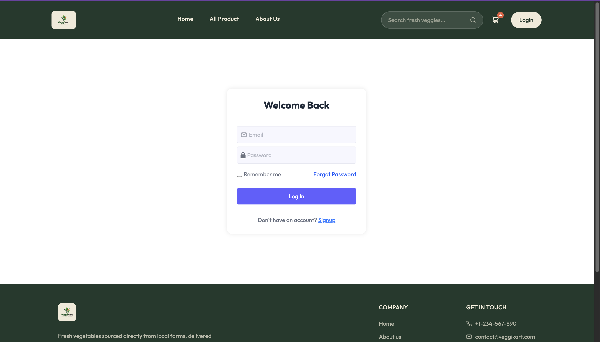
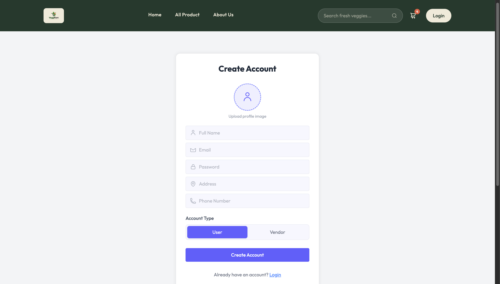
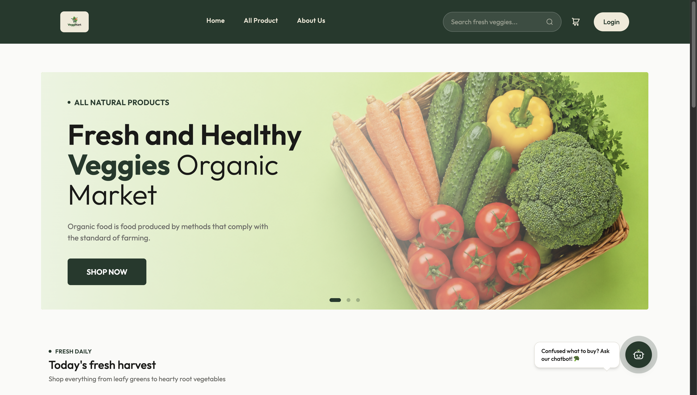
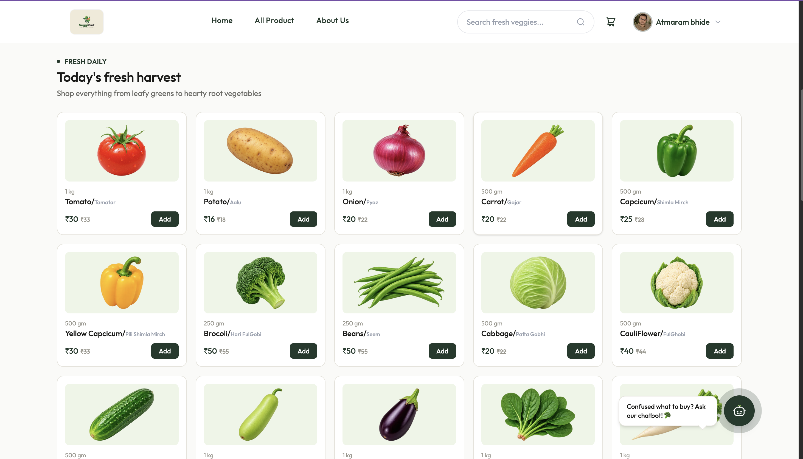
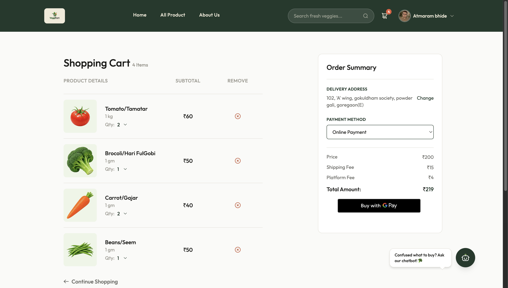
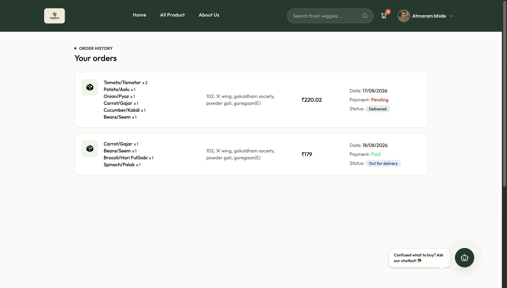
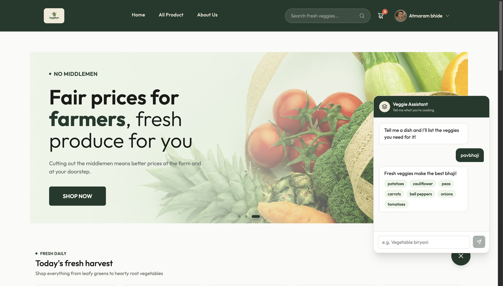
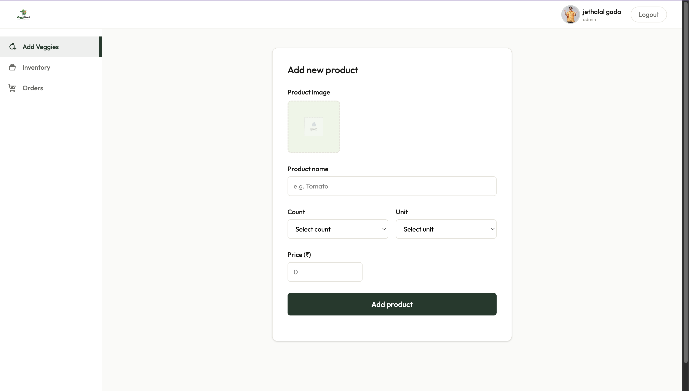
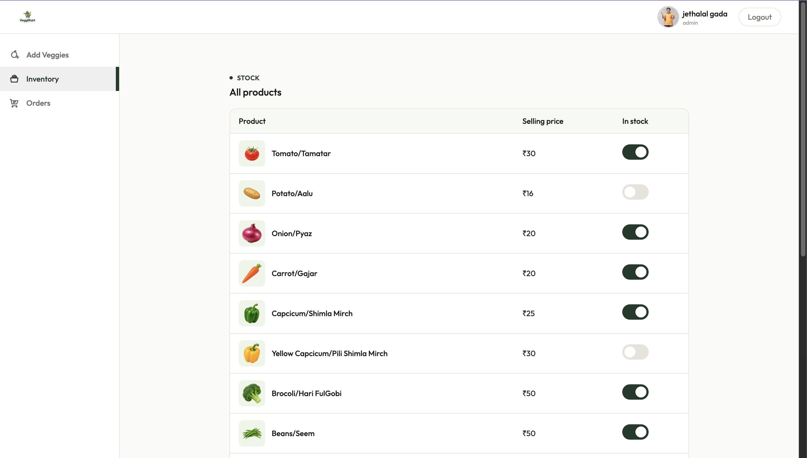
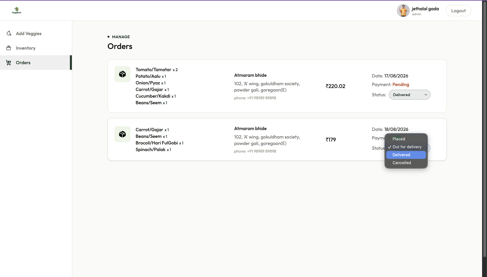

# 🥦 VeggieKart

A full-stack vegetable e-commerce platform built with **React, Node.js, Express.js, and MongoDB**. VeggieKart provides a complete shopping experience for users along with an admin dashboard for product inventory and order management.

## 🚀 Features

### 👤 User Features

* User registration and login
* JWT-based authentication with cookies
* Browse available vegetables and products
* Add products to cart
* Remove products from cart
* Place orders
* Google Pay integration *(test mode)*
* View placed orders
* Track order status updated by the admin
* Interact with an AI-powered chatbot

### 👨‍💼 Admin Features

* Admin authentication and role-based access
* Admin dashboard
* Add new products
* Update product information
* Manage product stock/availability
* View users' orders
* Update order status
* Manage the complete order workflow:

  * Order Placed
  * Out for Delivery
  * Delivered
  * Cancelled

### 🤖 AI Chatbot

VeggieKart includes an AI-powered chatbot that allows users to interact with the application and get assistance while browsing the store.

The chatbot is integrated with the backend and uses an AI API to process user queries.

### 🖼️ Image Management

Product images are handled using:

* **Multer** for receiving uploaded files
* **ImageKit** for cloud-based image storage

Uploaded files are temporarily stored on the server and removed after being successfully uploaded to ImageKit.

---

## 🛠️ Tech Stack

### Frontend

* React
* Vite
* React Router
* Axios
* Tailwind CSS
* JavaScript

### Backend

* Node.js
* Express.js
* MongoDB
* Mongoose
* JWT
* Cookie-based authentication
* Multer
* ImageKit

### Additional Technologies

* Google Pay *(test mode)*
* OpenRouter API for AI chatbot functionality

---

## 📸 Screenshots

### 🔐 Login



### 📝 Register



### 🏠 Home Page



### 🥕 Products



### 🛒 Shopping Cart



### 📦 User Orders



### 🤖 AI Chatbot



### 👨‍💼 Admin Dashboard



### 📊 Inventory Management



### 📦 Admin Order Management



---

## 🏗️ Project Structure

```text
VeggieKart/
│
├── backend/
│   ├── src/
│   │   ├── controllers/
│   │   ├── db/
│   │   ├── middlewares/
│   │   ├── models/
│   │   ├── routes/
│   │   └── services/
│   │
│   ├── images/
│   ├── .env.example
│   ├── package.json
│   └── server.js
│
├── client/
│   ├── public/
│   ├── src/
│   │   ├── AppContext/
│   │   ├── assets/
│   │   ├── components/
│   │   ├── pages/
│   │   ├── router/
│   │   └── services/
│   │
│   ├── .env.example
│   ├── package.json
│   └── vite.config.js
│
├── screenshots/
│
├── .gitignore
└── README.md
```

---

## 🔐 Authentication

VeggieKart uses **JWT-based authentication** for securing user sessions.

The authentication flow includes:

1. User registers an account.
2. User logs in with their credentials.
3. The backend generates a JWT.
4. The token is stored using cookies.
5. Authentication middleware verifies the token when protected resources are accessed.
6. Role-based access allows different functionality for users and administrators.

---

## 🛒 User Order Flow

```text
Browse Products
      ↓
Add to Cart
      ↓
Review Cart
      ↓
Place Order
      ↓
Payment
      ↓
Order Placed
      ↓
Admin Updates Status
      ↓
Out for Delivery
      ↓
Delivered
```

Orders can also be marked as **Cancelled** when applicable.

---

## 👨‍💼 Admin Order Flow

```text
User Places Order
        ↓
Admin Views Order
        ↓
Order Placed
        ↓
Out for Delivery
        ↓
Delivered
```

The admin can update the order status, and the updated status is reflected on the user's order page.

---

## 🖼️ Image Upload Flow

```text
User/Admin Selects Image
          ↓
       Multer
          ↓
Temporary Local Storage
          ↓
       ImageKit
          ↓
Cloud Image Storage
          ↓
Temporary File Deleted
```

This keeps the server from permanently storing uploaded product images locally.

---

## ⚙️ Getting Started

### Prerequisites

Make sure you have installed:

* Node.js
* npm
* MongoDB
* Git

### 1. Clone the repository

```bash
git clone https://github.com/qwertyxbtye/veggiekart.git
cd veggiekart
```

### 2. Install backend dependencies

```bash
cd backend
npm install
```

### 3. Install frontend dependencies

Open another terminal or return to the project root:

```bash
cd client
npm install
```

### 4. Configure environment variables

Create `.env` files based on the provided `.env.example` files.

#### Backend

```env
PORT=
MONGO_URL=
JWT_SECRET=
IMGKIT=
OPENROUTER_API_KEY=
```

#### Frontend

```env
VITE_BACKEND_URL=
```

Do not commit your `.env` files to GitHub.

### 5. Start the backend

From the `backend` directory:

```bash
npm start
```

If your `package.json` uses a different script, use the corresponding command.

### 6. Start the frontend

From the `client` directory:

```bash
npm run dev
```

The Vite development server will provide the local frontend URL.

---

## 🔑 Environment Variables

| Variable             | Purpose                                |
| -------------------- | -------------------------------------- |
| `PORT`               | Backend server port                    |
| `MONGO_URL`          | MongoDB connection string              |
| `JWT_SECRET`         | Secret used for JWT authentication     |
| `IMGKIT`             | ImageKit configuration                 |
| `OPENROUTER_API_KEY` | API key used for chatbot functionality |
| `VITE_BACKEND_URL`   | Backend URL used by the frontend       |

> **Important:** Never commit real API keys, database credentials, JWT secrets, or other sensitive values to GitHub.

---

## 🔮 Future Improvements

Some potential improvements for future versions include:

* Product search and advanced filtering
* More detailed order tracking
* Improved admin analytics
* Production payment integration
* Enhanced chatbot capabilities
* Product reviews and ratings
* Improved mobile responsiveness
* Deployment of the frontend and backend

---

## 📌 Project Status

**Completed full-stack project**

VeggieKart was developed as a full-stack e-commerce application with separate user and admin functionality, authentication, cart and order management, cloud image storage, payment integration in test mode, and AI chatbot functionality.

---

## 👨‍💻 Author

**Rohit Maity**

Built using React, Node.js, Express.js, MongoDB and modern web development technologies.
